# JavaScript — Complete Learning Guide

---

## Quick Reference

```
Step 0              How JS executes — Execution Context, Call Stack

PHASE 1 — JavaScript Foundations (01_foundations/)
Step 1              01_foundations/01_variables.js          Variables
Step 2              01_foundations/02_data_types.js         Data Types (Stack/Heap)
Step 3              01_foundations/03_hoisting.js           Hoisting
Step 4              01_foundations/04_tdz_block_scope.js    TDZ, Block Scope & Shadowing
Step 5              01_foundations/05_type_conversion.js    Type Conversion & Operations
Step 6              01_foundations/06_comparison.js         Comparison Operators
Step 7              01_foundations/07_strings.js            Strings
Step 8              01_foundations/08_numbers_math.js       Numbers & Math
Step 9              01_foundations/09_dates.js              Dates

PHASE 2 — Control Flow (02_control_flow/)
Step 10             02_control_flow/01_if_else.js …         if/else, switch, Truthy/Falsy, Ternary, ??
Step 11             02_control_flow/04_for_loop.js …        for, while, for-of, for-in

PHASE 3 — Functions (03_functions/)
Step 12             03_functions/01_functions.js            Functions
Step 13             03_functions/02_first_class_functions.js First Class Functions
Step 14             03_functions/03_arrow_functions.js      Arrow Functions
Step 15             03_functions/04_iife.js                 IIFE

PHASE 4 — Data Structures (04_data_structures/)
Step 16             04_data_structures/01_arrays_basics.js  Arrays — Basics
Step 17             04_data_structures/02_arrays_advanced.js Arrays — Advanced
Step 18             04_data_structures/03_objects_basics.js Objects — Basics
Step 19             04_data_structures/04_objects_advanced.js Objects — Advanced
Step 20             04_data_structures/05_filter.js …       filter, map, reduce (HOF)

PHASE 5 — Scope & Closures (05_scope_and_closures/)
Step 21             05_scope_and_closures/01_scope.js       Scope & Lexical Environment
Step 22             05_scope_and_closures/02_closures.js    Closures

PHASE 6 — DOM (06_dom/)
Step 23             06_dom/one.html                         DOM — Selecting & Reading Elements
Step 24             06_dom/two.html                         DOM — Traversal
Step 25             06_dom/three.html                       DOM — Creating & Inserting Elements
Step 26             06_dom/four.html                        DOM — Editing & Removing Elements

PHASE 7 — Events (07_events/)
Step 27             07_events/one.html, two.html            Events — Delegation, Bubbling & Event Object
Step 28             07_events/three.html                    Events — setTimeout & setInterval

PHASE 8 — Projects (08_projects/)
Step 29             08_projects/                            6 hands-on projects

PHASE 9 — Object-Oriented Programming (09_oop/)
Step 30             09_oop/00_this_keyword.js               this Keyword
Step 31             09_oop/oop.js, myClasses.js             OOP — Constructor Functions & Classes
Step 32             09_oop/Prototype.js                     Prototypes
Step 33             09_oop/inheritance.js                   Inheritance
Step 34             09_oop/getter_setter.js                 Getters & Setters
Step 35             09_oop/staticprop.js                    Static Methods
Step 36             09_oop/call.js                          .call(), .apply(), .bind()

PHASE 10 — Asynchronous JavaScript (10_async/)
Step 37             10_async/01_callback_hell.js            Callback Hell & Inversion of Control
Step 38             10_async/02_promises.js                 Promises & Async/Await
Step 39             10_async/03_try_catch.js                Error Handling
Step 40             10_async/04_custom_errors.js            Custom Error Classes
Step 41             10_async/05_promise_combinators.js      Promise Combinators
Step 42             10_async/06_settimeout_deep.js          setTimeout Deep Dive

PHASE 11 — Modern JavaScript (11_modern_js/)
Step 43             11_modern_js/02_set_and_map.js          Set and Map
Step 44             11_modern_js/03_json.js                 JSON
Step 45             11_modern_js/01_optional_chaining.js    Optional Chaining & Nullish Coalescing
Step 46             11_modern_js/04_array_methods.js        More Array Methods

PHASE 12 — Functional Programming (12_functional/)
Step 47             12_functional/01_currying.js            Currying and Function Composition

PHASE 13 — Deep Dive
Step 48             (Theory)                                JavaScript Engine & V8 Architecture
```

---

## Step 0 — How JavaScript Works

> *"Everything in JS happens inside the Execution Context."*

Before writing any code, understand what happens when JS runs. Every piece of code executes inside an **Execution Context** — a sealed container with two components:

| Component | Also Known As | Purpose |
|-----------|--------------|---------|
| Memory Component | Variable Environment | Stores all variables & functions as key-value pairs |
| Code Component | Thread of Execution | Executes code one line at a time |

**JavaScript is synchronous and single-threaded** — one command at a time, in order. It cannot do two things simultaneously.

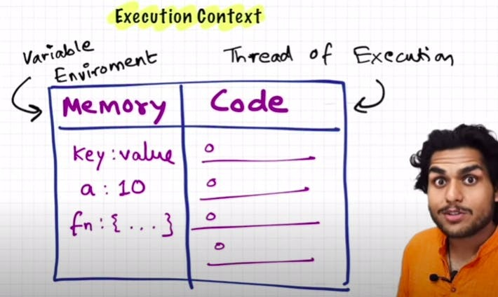

### Two Phases of Execution

When any JS program runs, the engine creates a **Global Execution Context (GEC)** and processes it in two phases:

**Phase 1 — Memory Creation (before any code runs):**
- Scans all code
- `var` variables → allocated in memory, initialized to `undefined`
- Function declarations → entire function body stored in memory
- `let`/`const` → allocated but kept in Temporal Dead Zone (inaccessible)

**Phase 2 — Code Execution (line by line):**
- Variables get their real values assigned
- Function calls create **new** execution contexts (with their own two phases)
- When a function returns, its execution context is deleted from the stack

```js
var n = 2
function square(num) {
    var ans = num * num
    return ans
}
var square2 = square(n)    // creates new execution context for square()
var square4 = square(4)    // creates another new execution context
```

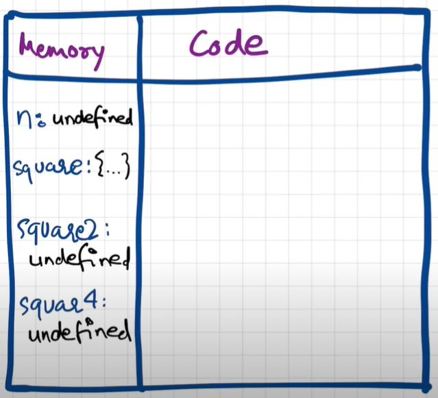
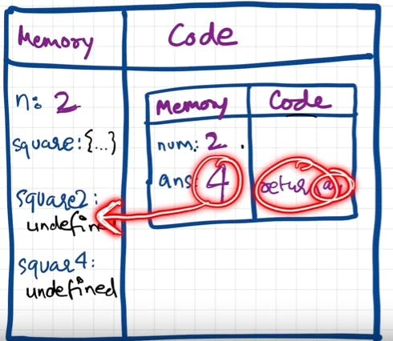
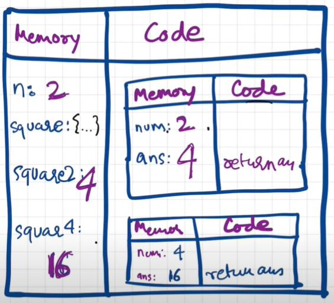

### The Call Stack

JavaScript manages execution context creation and deletion using the **Call Stack** — a mechanism that tracks which function is currently running.

- GEC is pushed when the program starts
- Each function call pushes a new execution context
- When a function returns, its context pops off
- When all code finishes, GEC pops off

Also known as: Program Stack, Control Stack, Runtime Stack, Machine Stack, Execution Context Stack.


---

**## Phase 1 — JavaScript Foundations**

---

## Step 1 — Variables

> [01_foundations/01_variables.js](01_foundations/01_variables.js)

A **variable** is a named container that holds a value. JavaScript has three ways to declare variables, each with different rules about reassignment and scope. Choosing the right one prevents subtle bugs.

- Use `const` by default — it signals the value should not change and makes code easier to reason about.
- Use `let` only when you genuinely need to reassign (e.g. a counter, a loop variable).
- Never use `var` in modern code — its function-scoping causes variables to leak out of `if` blocks and `for` loops unexpectedly.

| Keyword | Scope | Reassignable | Notes |
|---------|-------|-------------|-------|
| `const` | Block | No | Default choice |
| `let` | Block | Yes | When you need to reassign |
| `var` | Function | Yes | Avoid — leaks out of blocks |

```js
const accountId = 144553       // cannot be changed
let accountEmail = "a@b.com"   // can be updated
var accountPassword = "123"    // avoid — function-scoped
```

---

## Step 2 — Data Types

> [01_foundations/02_data_types.js](01_foundations/02_data_types.js)

JavaScript is **dynamically typed** — variables have no fixed type, and the type of a value is determined at runtime. Every value belongs to one of two categories: primitive or reference.

**7 Primitive types** (stored by value on the Stack):

| Type | Example | Notes |
|------|---------|-------|
| `Number` | `42`, `3.14` | Up to 2^53 − 1 safely |
| `BigInt` | `900n` | For integers beyond Number's limit |
| `String` | `"hello"` | Immutable sequence of characters |
| `Boolean` | `true` / `false` | Used for conditions and flags |
| `null` | `null` | Intentional absence of value |
| `undefined` | `let x;` | Declared but not yet assigned |
| `Symbol` | `Symbol('id')` | Guaranteed unique — used as object keys |

**Reference types** (stored by reference on the Heap): `Object`, `Array`, `Function`

> `typeof null === "object"` is a well-known historical JS bug — null is NOT an object.

### `undefined` vs `not defined`

These are two completely different things — a common confusion point:

- **`undefined`** — the variable was declared and memory was allocated in Phase 1, but no value has been assigned yet. JS uses `undefined` as the placeholder.
- **`not defined`** — the variable was never declared anywhere. Accessing it throws a `ReferenceError`.

```js
console.log(x)   // undefined — var x was hoisted, value not yet set
var x = 25
console.log(x)   // 25

console.log(a)   // ReferenceError: a is not defined — never declared
```

> JS is a **loosely typed** (weakly typed) language — variables have no fixed type. `var a = 5` can later become `a = true` or `a = "hello"`. Never manually assign `undefined` to a variable — let JS do it naturally during hoisting.

### Stack vs Heap Memory

Primitives are stored directly on the **Stack** — small, fast, fixed-size. Reference types live on the **Heap** — larger, dynamic memory. The Stack holds only a pointer (memory address) to the Heap location.


| | Stack | Heap |
|--|-------|------|
| **Stores** | Primitives | Objects, Arrays, Functions |
| **Copy behaviour** | Independent copy | Shared reference |
| **Mutation risk** | None — copy is isolated | Changes via one variable affect all references |

```js
// Stack — copy is independent, changing b does NOT affect a
let a = "hello"
let b = a
b = "world"
console.log(a)          // "hello" — unchanged

// Heap — obj1 and obj2 point to the SAME object in memory
let obj1 = { email: "a@b.com" }
let obj2 = obj1
obj2.email = "x@y.com"
console.log(obj1.email) // "x@y.com" — changed! both variables share one object
```

---

## Step 3 — Hoisting

> [01_foundations/03_hoisting.js](01_foundations/03_hoisting.js)

**Hoisting** is JavaScript's behaviour of allocating memory for variables and functions **before any code runs**. It happens during the Memory Creation phase of the Execution Context — the engine scans all code first, then executes it.

This is why you can call a function before its declaration, but not a variable before its assignment.


| Declaration type | Hoisted? | Value during TDZ / before declaration |
|-----------------|----------|--------------------------------------|
| `var` variable | Yes | `undefined` |
| Function declaration | Yes | Full function body — callable immediately |
| Function expression (`var f = fn`) | Partially | Variable hoisted as `undefined`; calling it → TypeError |
| `let` / `const` | Yes (to TDZ) | Inaccessible → ReferenceError |

```js
getName()           // "Namaste JavaScript" — works! (function declaration fully hoisted)
console.log(x)      // undefined — var hoisted, value not yet assigned
var x = 7

function getName() {
    console.log("Namaste JavaScript")
}

// Function expression — only the var is hoisted, not the function value
// greet()          // TypeError: greet is not a function
var greet = function() { console.log("Hi!") }
greet()             // "Hi!" — works after assignment
```

**Key insight:** hoisting is not magic. The engine runs in two passes — memory setup first, then execution. Understanding this explains almost every "why does this work?!" moment in JavaScript.

---

## Step 4 — Temporal Dead Zone, Block Scope & Shadowing

> [01_foundations/04_tdz_block_scope.js](01_foundations/04_tdz_block_scope.js)

**Temporal Dead Zone (TDZ):** The window between when a `let`/`const` variable is hoisted and when it is initialized. Accessing it during TDZ throws a `ReferenceError`. Best practice: declare variables at the top of their block to shrink TDZ to zero.

```js
// console.log(a)   // ReferenceError: Cannot access 'a' before initialization
let a = 10          // ← TDZ ends here
console.log(a)      // 10
```

**Block Scope:** `let` and `const` live only inside the `{ }` block they're declared in. `var` leaks out.

```js
{
    var leaks  = "visible outside"   // var → global/function scope
    let stays  = "invisible outside" // let → block scope only
}
console.log(leaks)   // "visible outside"
// console.log(stays) // ReferenceError
```

**Shadowing:** a variable inside a block with the same name as one outside creates its own independent copy (for `let`/`const`). `var` does NOT shadow — it modifies the outer variable.

```js
let score = 100
{
    let score = 20       // independent — own block memory
    console.log(score)   // 20
}
console.log(score)       // 100 — unchanged

var count = 100
{
    var count = 10       // same variable! overwrites outer
    console.log(count)   // 10
}
console.log(count)       // 10 — outer was modified
```


**Illegal shadowing:** you cannot shadow a `let` variable with `var` in the same scope — `var` would bleed into the outer scope where `let` already exists. But `let` can shadow `let`.

---

## Step 5 — Type Conversion & Operations

> [01_foundations/05_type_conversion.js](01_foundations/05_type_conversion.js)

JavaScript performs **type coercion** — automatic type conversion — in many situations. Understanding it prevents confusing bugs. You can also convert types explicitly using built-in functions.

**Explicit conversion** — you control it:

```js
Number("33")     // 33      — valid numeric string
Number("33abc")  // NaN     — not a number (invalid conversion)
Number(true)     // 1       — boolean to number
Boolean("")      // false   — empty string is falsy
Boolean("hi")    // true    — non-empty string is truthy
String(42)       // "42"    — number to string
```

**The `+` operator** has dual behaviour — addition for numbers, concatenation for strings. Since JS evaluates left to right, the first string it encounters switches everything to string mode:

```js
"1" + 2 + 2   // "122"  — "1" triggers string mode, then "12"+2="122"
1 + 2 + "2"   // "32"   — 1+2=3 (number), then 3+"2"="32" (string)
```

**Increment operators** — timing of the value matters:
```js
let x = 5
console.log(x++)  // 5  — returns THEN increments (post-increment)
console.log(++x)  // 7  — increments THEN returns (pre-increment)
```

---

## Step 6 — Comparison Operators

> [01_foundations/06_comparison.js](01_foundations/06_comparison.js)

Comparison operators return `true` or `false`. The most important rule: **always use `===` (strict equality)** instead of `==` (loose equality). Loose equality silently converts types before comparing, leading to surprising results.

- `==` — converts types, then compares values
- `===` — compares type **and** value with no conversion — predictable and safe

**null and undefined behave inconsistently with comparisons** — this is a known JS quirk:

```js
null > 0    // false — comparison converts null to 0, so 0 > 0 is false
null == 0   // false — == treats null specially, only equal to undefined
null >= 0   // true  — comparison converts null to 0, so 0 >= 0 is true ← surprising!

undefined == 0   // false
undefined > 0    // false — undefined becomes NaN, and NaN comparisons are always false
undefined <= 0   // false

"2" === 2   // false — string and number are different types
```

> Rule: never use `>`, `<`, `>=`, `<=` with `null` or `undefined`. The results are inconsistent.

---

## Step 7 — Strings

> [01_foundations/07_strings.js](01_foundations/07_strings.js)

A **string** is an immutable, ordered sequence of characters. Immutable means that string methods always return a **new** string — they never modify the original. Strings can be written with single quotes, double quotes, or backticks (template literals).

**Template literals** (backticks) are the modern standard — they support embedded expressions with `${}` and can span multiple lines without escape characters.

```js
const name = "hitesh"
`Hello ${name}`            // template literal — embeds expressions cleanly
```

**Common string methods** — all return new strings:

```js
str.charAt(2)              // character at index 2
str.indexOf('t')           // first position of 't' (-1 if not found)
str.substring(0, 4)        // extract characters from 0 to 3 (no negatives)
str.slice(-8, 4)           // like substring but supports negative index (counts from end)
str.trim()                 // remove whitespace from both ends
str.replace('%20', '-')    // replace first match only
str.includes('hello')      // true/false — does string contain this?
str.split('-')             // split into array using delimiter
str.toUpperCase()          // returns new UPPERCASED string
```

---

## Step 8 — Numbers & Math

> [01_foundations/08_numbers_math.js](01_foundations/08_numbers_math.js)

JavaScript has a single **Number** type for both integers and floating-point values (uses IEEE 754 double-precision). This means it can represent numbers up to 2^53 − 1 precisely. Beyond that, use `BigInt`.

**Number methods** — format and display numbers:

```js
(123.8966).toFixed(2)             // "123.90" — rounds to 2 decimal places (returns string)
(123.8966).toPrecision(4)         // "123.9"  — 4 significant digits (returns string)
(1000000).toLocaleString('en-IN') // "10,00,000" — locale-specific formatting
```

**The Math object** — a built-in collection of mathematical utilities:

```js
Math.abs(-4)    // 4   — absolute value (removes negative sign)
Math.round(4.6) // 5   — nearest integer
Math.ceil(4.2)  // 5   — always rounds UP (ceiling)
Math.floor(4.9) // 4   — always rounds DOWN (floor)
Math.min(4, 3)  // 3   — smallest value
Math.max(4, 3)  // 4   — largest value
Math.random()   // 0.573... — random float: 0 ≤ x < 1
```

**Random integer in a range** — the standard formula:
```js
// Gives a random integer from min to max, both inclusive
Math.floor(Math.random() * (max - min + 1)) + min
```

---

## Step 9 — Dates

> [01_foundations/09_dates.js](01_foundations/09_dates.js)

The **Date** object represents a single point in time. Internally, it stores dates as the number of milliseconds since the **Unix Epoch** (January 1, 1970, 00:00:00 UTC). This timestamp is universal across timezones.

One critical gotcha: **months are 0-indexed** (0 = January, 11 = December). Days are 1-indexed and weekdays start at 0 (Sunday).

```js
new Date()                   // current date and time
new Date(2023, 0, 23)        // Jan 23 2023 — month 0 = January!
new Date("2023-01-14")       // ISO format — most reliable string format
```

**Reading parts of a date:**

```js
date.getFullYear()   // 4-digit year
date.getMonth() + 1  // month 1–12 (must add 1 — internally 0-indexed)
date.getDate()       // day of month 1–31
date.getDay()        // weekday: 0=Sunday, 1=Monday … 6=Saturday
```

**Timestamps:**
```js
Date.now()           // milliseconds since epoch — useful for IDs and timing
date.getTime()       // same but for a specific Date instance
```

---

**## Phase 2 — Control Flow**

---

## Step 10 — Control Flow

> [02_control_flow/01_if_else.js](02_control_flow/01_if_else.js) | [02_switch.js](02_control_flow/02_switch.js) | [03_truthy_falsy.js](02_control_flow/03_truthy_falsy.js)

**Control flow** determines which code runs and when. JavaScript evaluates conditions using **truthy/falsy** — every value is treated as either `true` or `false` in a boolean context. This means you can write `if (value)` even when `value` is not a boolean.

**Falsy values** — the complete list (only these 8 values are falsy):
`false`, `0`, `-0`, `0n`, `""`, `null`, `undefined`, `NaN`

**Truthy gotchas** — these are truthy even though they look "empty":
`"0"`, `[]` (empty array), `{}` (empty object), `function(){}`

```js
// if / else if / else
if (score > 90) { ... }
else if (score > 60) { ... }
else { ... }

// switch — uses strict === comparison, always add break to prevent fall-through
switch (month) {
    case "jan": console.log("January"); break;
    default:    console.log("Other");   break;
}

// Ternary — compact if/else for a single expression
age >= 18 ? "adult" : "minor"

// Nullish Coalescing (??) — returns right side ONLY when left is null or undefined
// Unlike ||, it does NOT trigger on 0 or "" — useful for preserving falsy values
let val = userInput ?? "default"
```

---

## Step 11 — Loops

> [02_control_flow/04_for_loop.js](02_control_flow/04_for_loop.js) | [05_while.js](02_control_flow/05_while.js) | [06_do_while.js](02_control_flow/06_do_while.js) | [07_for_of_in.js](02_control_flow/07_for_of_in.js) | [08_foreach.js](02_control_flow/08_foreach.js)

**Loops** repeat a block of code. Choosing the right loop makes code clearer and avoids bugs.

| Loop | Best for |
|------|---------|
| `for` | Known number of iterations |
| `while` | Unknown count, condition checked before body |
| `do...while` | Must run at least once regardless of condition |
| `for...of` | Iterating VALUES of arrays, strings, Maps, Sets |
| `for...in` | Iterating KEYS of plain objects |

```js
for (let i = 0; i < 10; i++) { }        // classic counter loop

while (condition) { }                    // runs 0 or more times

do { } while (condition)                 // always runs at least once

for (const item of array) { }           // values: "js", "ruby", "python"

for (const key in object) {             // keys: "name", "age", "email"
    console.log(key, object[key])
}
```

**Loop control:**
- `break` — exit the loop entirely, skip remaining iterations
- `continue` — skip only the current iteration, jump to the next one

---

**## Phase 3 — Functions**

---

## Step 12 — Functions

> [03_functions/01_functions.js](03_functions/01_functions.js)

A **function** is a reusable block of code that runs when called. Functions are **first-class citizens** in JavaScript — they can be stored in variables, passed as arguments, and returned from other functions. This property is what makes higher-order functions (like `map`, `filter`) possible.

**Declaration vs Expression:**
- **Declaration** — hoisted, can be called before it appears in code
- **Expression** — assigned to a variable, NOT hoisted

```js
// Declaration — hoisted, callable anywhere in its scope
function add(a, b) { return a + b }

// Default parameter — used when argument is missing or undefined
function greet(name = "Guest") { return `Hello ${name}` }
greet()          // "Hello Guest"
greet("Hitesh")  // "Hello Hitesh"

// Rest parameter (...) — collects ALL remaining arguments into an array
// Must always be the LAST parameter
function cart(a, b, ...rest) { return rest }
cart(1, 2, 3, 4, 5)  // rest = [3, 4, 5]
```

Functions can receive and return objects and arrays — since these are reference types, mutations inside the function affect the original:
```js
function handleObject(obj) {
    console.log(`${obj.username} — ${obj.price}`)
}
handleObject({ username: "sam", price: 399 })  // pass object literal directly
```

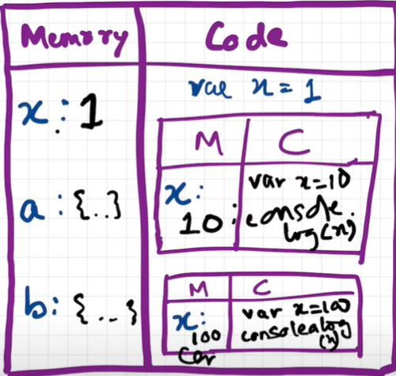

---

## Step 13 — First Class Functions

> [03_functions/02_first_class_functions.js](03_functions/02_first_class_functions.js)

In JavaScript, **functions are first-class citizens** — they can be stored in variables, passed as arguments, and returned from other functions, just like any other value.

**Function types and their hoisting behaviour:**

| Type | Hoisted? | Syntax |
|------|----------|--------|
| Function Statement (Declaration) | Yes — fully callable | `function foo() {}` |
| Function Expression | No — `undefined` until assigned | `const foo = function() {}` |
| Named Function Expression | No | `const foo = function bar() {}` |
| Anonymous Function | No — must be used as a value | `function() {}` |
| Arrow Function | No | `const foo = () => {}` |

```js
// Function Statement — hoisted, callable before declaration
a()                                    // "Hello A"
function a() { console.log("Hello A") }

// Function Expression — NOT hoisted
// b()                                 // TypeError: b is not a function
var b = function() { console.log("Hello B") }
b()  // works here

// Named Function Expression — name only accessible internally (for recursion)
var factorial = function computeFactorial(n) {
    return n <= 1 ? 1 : n * computeFactorial(n - 1)
}
factorial(5)   // 120
// computeFactorial  // ReferenceError — name not in outer scope
```

**First-class in action:**
```js
// Pass a function as argument
[1, 2, 3].map(x => x * 2)          // [2, 4, 6]

// Return a function from a function
const makeMultiplier = factor => number => number * factor
const double = makeMultiplier(2)
double(5)   // 10
[1,2,3].map(double)  // [2, 4, 6]
```

---

## Step 14 — Arrow Functions

> [03_functions/03_arrow_functions.js](03_functions/03_arrow_functions.js)

**Arrow functions** (`=>`) were introduced in ES6 as a shorter syntax for writing functions. They are ideal for callbacks and short expressions. Their most important characteristic is how they handle `this` — unlike regular functions, arrow functions do not have their own `this`; they inherit it from the surrounding scope where they were defined.

**Syntax variations:**
```js
const add = (a, b) => { return a + b }  // explicit return with block body
const add = (a, b) => a + b             // implicit return — no braces, no return keyword
const double = a => a * 2               // single parameter — parens optional
const makeObj = a => ({ value: a })     // returning object literal — must wrap in ()
                                        // otherwise {} is read as a function body
```

**`this` binding — the critical difference:**

| Function type | `this` value |
|--------------|-------------|
| Regular function / method | The object that called it (dynamic — set at call time) |
| Arrow function | Inherited from the enclosing scope (lexical — set at definition time) |

This is why you should NOT use arrow functions as object methods when you need `this` to refer to the object. Use regular functions for methods, arrow functions for callbacks.

---

## Step 15 — IIFE

> [03_functions/04_iife.js](03_functions/04_iife.js)

An **IIFE (Immediately Invoked Function Expression)** is a function that defines and runs itself in a single step. The outer `()` makes the function an expression (rather than a declaration), and the final `()` calls it immediately.

**Why use IIFE?**
- Runs setup/initialisation code exactly once (e.g. DB connection, config)
- Creates a **private scope** — variables inside are not accessible globally
- Avoids polluting the global namespace, especially important in older JS before modules

```js
// Named IIFE — name is useful for stack traces during debugging
(function init() {
    console.log("Runs immediately")
})();

// Arrow IIFE with a parameter
((name) => {
    console.log(`Hello ${name}`)
})('hitesh');
```

---

**## Phase 4 — Data Structures**

---

## Step 16 — Arrays (Basics)

> [04_data_structures/01_arrays_basics.js](04_data_structures/01_arrays_basics.js)

An **array** is an ordered, indexed list of values. Arrays in JavaScript are dynamic — they grow and shrink automatically, can hold mixed types, and are zero-indexed (first element is at index `0`). Under the hood, arrays are a special kind of object.

**Mutation methods** — these modify the original array directly:

```js
arr.push(val)    // add to END → returns new length
arr.pop()        // remove from END → returns removed element
arr.unshift(val) // add to BEGINNING → returns new length
arr.shift()      // remove from BEGINNING → returns removed element
```

**The most confused pair — `slice` vs `splice`:**

| | `slice` | `splice` |
|--|--------|---------|
| Modifies original? | No — returns a new array | Yes — removes from original |
| Parameters | `(start, end)` | `(start, deleteCount)` |
| Use for | Copying a portion | Removing or inserting |

```js
arr.slice(1, 3)   // returns NEW array of indices 1 and 2, original UNCHANGED
arr.splice(1, 3)  // REMOVES 3 elements starting at index 1, mutates original
```

---

## Step 17 — Arrays (Advanced)

> [04_data_structures/02_arrays_advanced.js](04_data_structures/02_arrays_advanced.js)

Beyond mutation methods, JavaScript arrays have powerful utilities for combining, flattening, and creating arrays. The **spread operator** (`...`) is the modern, preferred approach for merging because it creates a new array without mutating either source.

**Merging arrays:**
```js
[...arr1, ...arr2]          // spread — creates new merged array (preferred)
arr1.concat(arr2)           // classic — also creates new array
arr1.push(arr2)             // WRONG for merging — nests arr2 as a single element!
```

**Flattening nested arrays** — `flat(depth)` removes nesting levels:
```js
[1, [2, [3, [4]]]].flat(1)         // [1, 2, [3, [4]]] — one level
[1, [2, [3, [4]]]].flat(Infinity)  // [1, 2, 3, 4] — completely flat
```

**Array utility methods:**
```js
Array.isArray(val)    // true/false — the only reliable way to check if something is an array
Array.from("hello")   // ["h","e","l","l","o"] — converts any iterable to array
Array.from({name:"x"}) // [] — plain objects are NOT iterable, returns empty array
Array.of(1, 2, 3)     // [1, 2, 3] — unlike new Array(3) which creates [,,,] (3 empty slots)
```

---

## Step 18 — Objects (Basics)

> [04_data_structures/03_objects_basics.js](04_data_structures/03_objects_basics.js)

An **object** is an unordered collection of key-value pairs. Keys are strings (or Symbols) and values can be anything — numbers, strings, arrays, functions, or even other objects. Objects are the foundation of JavaScript — almost everything in JS is an object.

Two access styles — use dot notation by default, bracket notation when the key contains spaces, is dynamic, or is a Symbol:

```js
const sym = Symbol("key1")  // Symbol — always unique, even with same description
const obj = {
    name: "Hitesh",
    "full name": "Hitesh C",   // key with space — bracket notation required
    [sym]: "mykey1",           // Symbol key — bracket notation required
    age: 18,
}

obj.name           // dot notation — works for simple identifier keys
obj["full name"]   // bracket notation — required for keys with spaces
obj[sym]           // bracket notation — required for Symbol keys
```

**Freezing** prevents any further modification:
```js
Object.freeze(obj)  // obj is now immutable — all changes silently fail
```

**Methods on objects** — functions stored as properties. Inside a method, `this` refers to the object:
```js
obj.greet = function() { console.log(`Hi ${this.name}`) }
obj.greet()   // "Hi Hitesh"
```

---

## Step 19 — Objects (Advanced)

> [04_data_structures/04_objects_advanced.js](04_data_structures/04_objects_advanced.js)

**Merging objects** — the spread operator is preferred because it creates a new object without modifying either source. `Object.assign` mutates the target:

```js
const merged = { ...obj1, ...obj2 }   // new object (preferred)
Object.assign({}, obj1, obj2)         // also creates new object — target is {}
// { obj1, obj2 } ← this NESTS them, does NOT merge!
```

**Object utility methods** — inspect object contents:

```js
Object.keys(obj)           // ["id", "name", ...] — array of property names
Object.values(obj)         // ["123", "Sammy", ...] — array of values
Object.entries(obj)        // [["id","123"], ...] — array of [key, value] pairs
obj.hasOwnProperty('key')  // true if property exists directly on obj (not inherited)
```

**Destructuring** — extract properties into variables in one step. Renaming avoids conflicts:

```js
const course = { coursename: "js", price: "999", courseInstructor: "hitesh" }

const { courseInstructor } = course                    // variable named courseInstructor
const { courseInstructor: instructor } = course        // renamed to instructor
console.log(instructor)  // "hitesh"
```

---

## Step 20 — Array Higher-Order Methods

> [04_data_structures/05_filter.js](04_data_structures/05_filter.js) | [06_map.js](04_data_structures/06_map.js) | [07_reduce.js](04_data_structures/07_reduce.js)

**Higher-order functions (HOF)** are functions that accept functions as arguments or return functions. They embody the **DRY principle** — instead of writing a new loop for every operation, you write the operation once and pass it to a generic HOF.

```js
// ❌ Without HOF — duplicate loop structure for every operation
const calculateArea = (radius) => {
    const output = []
    for (let i = 0; i < radius.length; i++) {
        output.push(Math.PI * radius[i] * radius[i])
    }
    return output
}

// ✅ With HOF — separate the "what" from the "how"
const area          = r => Math.PI * r * r
const circumference = r => 2 * Math.PI * r

const calculate = (radiusArr, operation) =>
    radiusArr.map(operation)   // one generic function handles all operations

const radii = [1, 2, 3, 4]
calculate(radii, area)           // areas
calculate(radii, circumference)  // circumferences
```

> A function that receives another function is the caller — a **Higher-Order Function**. The function that was passed in is the **Callback Function**.

| Method | Returns | Mutates original? | Purpose |
|--------|---------|-------------------|---------|
| `forEach` | `undefined` | No | Side effects only — cannot be chained |
| `filter` | New shorter array | No | Keep only matching elements |
| `map` | New same-length array | No | Transform every element |
| `reduce` | Single accumulated value | No | Collapse array to one result |

```js
const arr = [5, 1, 3, 2, 6]

// map — transform each element
arr.map(x => x * 2)      // [10, 2, 6, 4, 12]
arr.map(x => x.toString(2))  // binary: ["101", "1", "11", "10", "110"]

// filter — keep elements where callback returns true
arr.filter(x => x % 2)  // odd numbers: [5, 1, 3]

// reduce — collapse to a single value
arr.reduce((acc, curr) => acc + curr, 0)  // sum: 17
arr.reduce((max, curr) => curr > max ? curr : max, 0)  // max: 6

// chaining — each method receives the result of the previous
const users = [
    { firstName: "Alok",   age: 23 },
    { firstName: "Ashish", age: 29 },
    { firstName: "Pranav", age: 50 },
]
// First names of all users under 30
users.filter(u => u.age < 30).map(u => u.firstName)
// ["Alok", "Ashish"]

// Same with reduce (interview pattern)
users.reduce((acc, curr) => {
    if (curr.age < 30) acc.push(curr.firstName)
    return acc
}, [])
// ["Alok", "Ashish"]

// reduce for object output — count unique ages
users.reduce((acc, curr) => {
    acc[curr.age] = (acc[curr.age] || 0) + 1
    return acc
}, {})
// { 23: 1, 29: 1, 50: 1 }
```

> Always provide an `initialValue` (second argument) to `reduce` — without it, `reduce` uses the first element as the initial accumulator, which causes a `TypeError` on empty arrays.

---

**## Phase 5 — Scope & Closures**

---

## Step 21 — Scope & Lexical Environment

> [05_scope_and_closures/01_scope.js](05_scope_and_closures/01_scope.js)

**Scope** determines where in your code a variable is accessible. JavaScript has three nested levels of scope. Understanding scope is essential to avoid naming conflicts and unexpected behaviour.

```
Global Scope               ← accessible everywhere
└── Function Scope         ← accessible only inside the function
    └── Block Scope        ← accessible only inside { } (if, for, etc.)
```

- `let` / `const` — **block-scoped**: confined inside the nearest `{}`
- `var` — **function-scoped**: ignores block boundaries, leaks out of `if` and `for` blocks
- **Lexical scope**: an inner function can read outer variables, but the outer cannot read inner variables

> **Important — `var` is function-scoped, not global-scoped:**
> `var`'s only scoping rule is the nearest enclosing **function**. When declared outside any function it ends up in the global scope — but that is just a *consequence* of no function existing to contain it, not a separate scoping type.
>
> ```js
> if (true) {
>     var x = 10;   // leaks out — no function boundary here
> }
> console.log(x);   // 10 ✅ — if {} is not a scope boundary for var
>
> function foo() {
>     var y = 20;   // contained — function IS a boundary for var
> }
> console.log(y);   // ReferenceError ❌ — var cannot escape a function
> ```
>
> | Scope boundary | `var` | `let` / `const` |
> |---|---|---|
> | `if` / `for` / `while` `{}` | leaks out | confined |
> | function `{}` | confined | confined |
>
> `var` has one scope type: **function scope**. The fact that top-level `var` becomes global is just what happens when there is no function to scope it to.

### Lexical Environment & Scope Chain

Every execution context carries a **Lexical Environment** = its own local memory + a reference to its parent's lexical environment. When JS looks up a variable, it walks this chain until it finds it or reaches `null` (global's parent).

```js
function a() {
    c()
    function c() {
        console.log(b)   // 10 — found by walking up: c → a → global
    }
}
var b = 10
a()

// But global can NOT access local variables:
function a() {
    var b = 10
}
a()
console.log(b)   // ReferenceError — b is not in global scope
```

```
call stack:  [GEC, a(), c()]
c() lexical environment → points to a()
a() lexical environment → points to GEC
GEC lexical environment → points to null
```

> *"An inner function can access variables from any outer function, no matter how deeply nested. But the reverse is never true."*

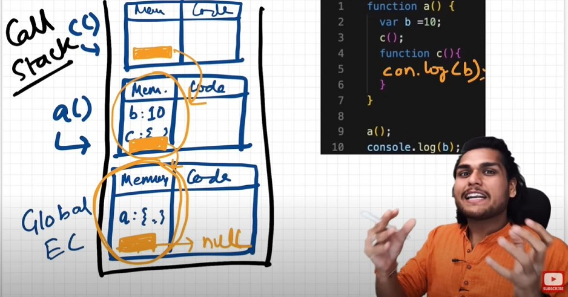


**Hoisting** — JS moves declarations to the top of their scope before execution:

```js
// Function declarations are fully hoisted — callable BEFORE definition
console.log(addOne(5))   // ✅ 6 — works even though function is below
function addOne(n) { return n + 1 }

// Function expressions are NOT hoisted
addTwo(5)                // ❌ TypeError: addTwo is not a function
const addTwo = (n) => n + 2
```

---

## Step 22 — Closures

> [05_scope_and_closures/02_closures.js](05_scope_and_closures/02_closures.js)

A **closure** is a function that **remembers and continues to access variables from its outer scope** even after the outer function has finished executing. This happens because when a function is created in JS, it captures a reference to the surrounding **lexical environment** — not a snapshot copy, but a live reference.

Closures are not a special syntax — they are a natural consequence of how JavaScript handles scope and first-class functions. Every function in JS is a closure.

```js
function makeCounter() {
    let count = 0              // count lives in the closure — not accessible outside
    return function() {
        count++                // inner function closes over count
        return count
    }
}

const counter = makeCounter()  // makeCounter has finished, but count lives on
counter()  // 1 — count is remembered
counter()  // 2 — same count, still incrementing
counter()  // 3
```

**Function factory — each call creates its own independent closure:**
```js
function makeFunc() {
    const name = "Mozilla"      // would normally be destroyed when makeFunc returns
    return function displayName() {
        console.log(name)       // but closure keeps name alive
    }
}
const myFunc = makeFunc()
myFunc()   // "Mozilla" — name is still accessible through the closure
```

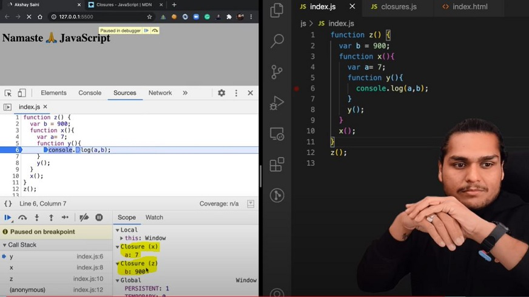

**Why closures matter — common real-world uses:**
- **Data privacy** — variables inside a closure are not accessible from outside
- **Stateful functions** — counters, caches, accumulators that persist between calls
- **Event handlers** — callbacks that remember context from when they were created
- **Function factories** — generate customised functions (like `makeCounter()` above)
- **Memoization** — cache expensive computation results across calls

**Disadvantages of closures:**
- Over-consumption of memory — closed-over variables are never garbage collected as long as the closure exists
- Memory leaks if closures are held longer than needed (e.g. forgotten event listeners)
- Can freeze the browser if many closures accumulate large data

### Classic Interview Question: setTimeout + Closures

```js
// ❌ Common mistake — all callbacks share the same var i
function x() {
    for (var i = 1; i <= 5; i++) {
        setTimeout(function() {
            console.log(i)   // prints 6 five times — closure captures REFERENCE to i
        }, i * 1000)
    }
}
x()
// Output: 6 6 6 6 6  (NOT 1 2 3 4 5)
// Why? All 5 callbacks close over the SAME i. By the time they fire, the loop has ended and i = 6.

// ✅ Fix 1: Use let (block-scoped — each iteration gets its own i)
function x() {
    for (let i = 1; i <= 5; i++) {
        setTimeout(function() {
            console.log(i)   // each closure captures its own block-scoped i
        }, i * 1000)
    }
}
// Output: 1 2 3 4 5  ✓

// ✅ Fix 2: Use a closure wrapper (works with var)
function x() {
    for (var i = 1; i <= 5; i++) {
        function close(i) {
            setTimeout(function() {
                console.log(i)   // each call to close() creates a new i in its scope
            }, i * 1000)
        }
        close(i)   // new copy of i created for each iteration
    }
}
// Output: 1 2 3 4 5  ✓
```

> The key insight: `var` variables are shared across all loop iterations (one shared reference). `let` creates a new binding per iteration (each iteration is a separate closure scope). When callbacks fire later, `var` sees the final value; `let` sees the per-iteration value.

---

**## Phase 6 — DOM**

---

## Step 23 — DOM: Selecting & Reading Elements

> [06_dom/one.html](06_dom/one.html)

### What is the DOM?

The **DOM (Document Object Model)** is a tree-like structure that illustrates the hierarchical relationship between HTML elements. The browser generates this tree of nodes when it loads a page — each node represents an element, attribute, or piece of text, and has its own properties and methods that JavaScript can read and change.

JavaScript does not modify HTML files directly. Instead, it reads and manipulates this live in-memory DOM tree, and the browser reflects those changes on screen instantly.


### Selection Methods

| Method | Returns | Notes |
|--------|---------|-------|
| `getElementById('id')` | Single element | Fastest — ids must be unique |
| `getElementsByTagName('tag')` | HTMLCollection (live) | All elements with that tag, in document order |
| `getElementsByClassName('cls')` | HTMLCollection (live) | Pass multiple classes separated by spaces |
| `getElementsByName('name')` | NodeList | Matches the `name` attribute value |
| `querySelector('css')` | Single element | First match of any CSS selector |
| `querySelectorAll('css')` | Static NodeList | All matches — empty NodeList if none found |

```js
document.getElementById('title')              // fastest for id lookup
document.getElementsByTagName('h2')           // all <h2> elements
document.getElementsByClassName('list-item')  // all elements with that class
document.querySelector('.list-item')          // first .list-item
document.querySelectorAll('.list-item')       // all .list-item as NodeList
```

### Reading Content

```js
element.innerHTML    // HTML string including child tags (parses HTML)
element.innerText    // only visible text — respects CSS (display:none is excluded)
element.textContent  // all raw text including hidden — does not parse HTML
```

---

## Step 24 — DOM: Traversal (Parent / Child / Sibling)

> [06_dom/two.html](06_dom/two.html)

**DOM traversal** lets you navigate the tree relative to an element you already hold — without running another `querySelector`. This is useful when you have a reference to one node and need to reach its neighbours.

A key distinction: **element nodes** vs **all nodes**. Whitespace text between tags (newlines, spaces) and HTML comments are also nodes in the DOM tree. The `children` / `firstElementChild` / `nextElementSibling` properties skip these non-element nodes and return only actual HTML elements.

```js
element.children              // HTMLCollection — child elements only (no text nodes)
element.childNodes            // NodeList — ALL child nodes including whitespace and comments
element.firstElementChild     // first child element
element.lastElementChild      // last child element
element.parentElement         // direct parent element
element.nextElementSibling    // next sibling element
element.previousElementSibling // previous sibling element
```

> **Rule:** prefer `children` over `childNodes`. `childNodes` includes invisible whitespace text nodes that come from newlines in your HTML, which makes counting and indexing unreliable.

---

## Step 25 — DOM: Creating & Inserting Elements

> [06_dom/three.html](06_dom/three.html)

JavaScript can build entirely new HTML elements from scratch and inject them into the page — no hard-coded HTML required. This is the foundation of dynamic UIs (adding todo items, loading cards from an API, etc.).

The process is always three steps: **create → configure → insert**.

```js
// 1. Create — element exists in memory but is NOT in the page yet
const div = document.createElement('div')

// 2. Configure
div.className = "main"
div.id = "box1"
div.setAttribute("title", "my box")
div.style.backgroundColor = "green"
div.style.padding = "12px"

// innerHTML vs createTextNode:
// innerHTML = "<b>text</b>"  parses HTML — risky with user input (XSS)
// createTextNode("text")     treats content as plain text — safe
const text = document.createTextNode("Hello")
div.appendChild(text)

// 3. Insert — now it appears on the page
document.body.appendChild(div)      // adds as last child of body
```

---

## Step 26 — DOM: Editing & Removing Elements

> [06_dom/four.html](06_dom/four.html)

After selecting an element you can replace it entirely or remove it from the page. These operations change the live DOM immediately and the browser re-renders in response.

**Editing:**
```js
element.replaceWith(newElement)        // swaps element with newElement in the tree
element.outerHTML = '<li>New</li>'     // replaces the element AND its tag with raw HTML string
                                       // ⚠️ original variable now points to a detached node
element.textContent = "plain text"     // safe text replacement (no HTML parsing)
element.innerHTML = "<b>bold</b>"      // replaces inner HTML (parses tags — XSS risk with user input)
```

**Removing:**
```js
element.remove()                       // removes element from the DOM entirely
```

**Useful CSS pseudo-selectors for targeting specific children:**
```js
document.querySelector('li:nth-child(2)')  // second li
document.querySelector('li:first-child')   // first li
document.querySelector('li:last-child')    // last li
```

---

**## Phase 7 — Events**

---

## Step 27 — Events: Delegation, Bubbling & the Event Object

> [07_events/one.html](07_events/one.html) | [two.html](07_events/two.html)

An **event** is a signal that something happened — a click, key press, mouse move, form submission. JavaScript listens for events using `addEventListener` and responds with a callback function.

**Event Delegation** is the pattern of attaching a single listener to a **parent** element and using `e.target` to determine which child triggered it. This is more efficient than attaching a listener to every child, and it automatically covers dynamically added elements.

```js
// Without delegation — a listener on every image (wasteful)
// document.getElementById('owl').onclick = function() { alert("owl clicked") }

// With delegation — ONE listener on the parent handles ALL images
document.querySelector('#images').addEventListener('click', function(e) {
    console.log(e.target.tagName)       // "IMG", "LI", "UL" — whatever was clicked
    if (e.target.tagName === 'IMG') {
        e.target.parentNode.remove()    // remove the <li> wrapping the image
    }
})
```

**Event object properties:**

| Property / Method | Description |
|------------------|-------------|
| `e.target` | The element actually clicked (deepest in the tree) |
| `e.currentTarget` | The element the listener is attached to |
| `e.target.tagName` | Tag name in UPPERCASE: `"IMG"`, `"LI"` |
| `e.timeStamp` | Milliseconds since page load when event fired |
| `e.stopPropagation()` | Stop event travelling further up or down the tree |
| `e.preventDefault()` | Cancel the browser's default action (link navigation, form submit) |

**Event propagation — Bubbling vs Capturing:**
- **Bubbling** (default, `false`) — event travels UP from the clicked element to the root
- **Capturing** (`true`) — event travels DOWN from the root to the clicked element
```js
element.addEventListener('click', handler, false)  // bubbling (default)
element.addEventListener('click', handler, true)   // capturing
```

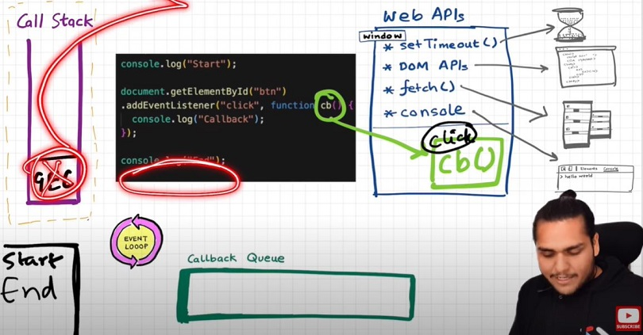

**Event listeners and closures** — using a closure keeps the counter variable private and safe from global mutation:

```js
// ❌ Global variable — anyone can modify count
let count = 0
document.getElementById("btn").addEventListener("click", function() {
    console.log("Clicked", ++count)
})

// ✅ Closure — count is private to attachEventList
function attachEventList() {
    let count = 0
    document.getElementById("btn").addEventListener("click", function() {
        console.log("Clicked", ++count)  // callback closes over count
    })
}
attachEventList()
```

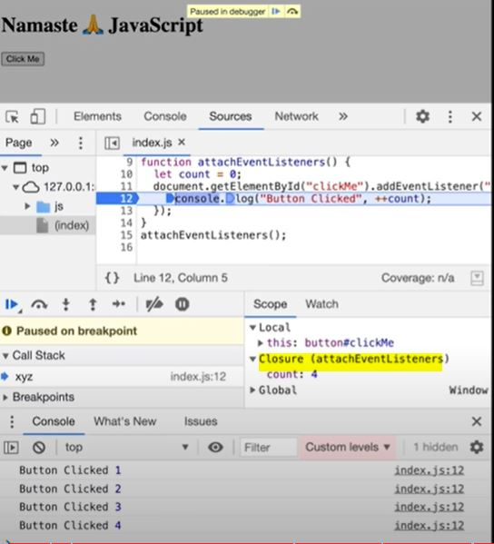

> Event listeners are heavy — they hold closures alive even after the call stack empties. Always call `removeEventListener` when a listener is no longer needed, so the garbage collector can reclaim its memory.

---

## Step 28 — Events: setTimeout & setInterval

> [07_events/three.html](07_events/three.html)

`setTimeout` and `setInterval` are **Web APIs** — they run outside the JavaScript call stack and use the Event Loop to deliver their callbacks when ready. Neither blocks the main thread.

**setTimeout** — schedule a function to run **once** after a delay:
```js
// Returns a timer ID — save it if you want to cancel
const id = setTimeout(fn, 2000)   // fires fn after 2 seconds
clearTimeout(id)                  // cancel it before it fires — fn will never run
```

**setInterval** — schedule a function to run **repeatedly** at a fixed interval:
```js
const id = setInterval(fn, 1000)  // fires fn every 1 second
clearInterval(id)                 // stop — fn will no longer be called
```

**Guard pattern** — prevents stacking multiple intervals if Start is clicked repeatedly:
```js
let intervalId
document.querySelector('#start').addEventListener('click', () => {
    if (!intervalId) {                        // only create if not already running
        intervalId = setInterval(fn, 1000)
    }
})
document.querySelector('#stop').addEventListener('click', () => {
    clearInterval(intervalId)
    intervalId = null    // reset the guard so Start works again
})
```

---

**## Phase 8 — Projects**

---

## Step 29 — Projects

> [08_projects/](08_projects/)

Six hands-on projects that apply DOM, Events, and core JS together. Reading the source code alongside the README comments is the best way to see how concepts connect in practice.

| # | Project | Key Concepts Applied |
|---|---------|---------------------|
| 1 | [Color Changer](08_projects/01_colorChanger/) | `querySelectorAll`, `forEach`, `e.target.id`, inline style |
| 2 | [BMI Calculator](08_projects/02_BMI_Calculator/) | Form `submit`, `preventDefault`, `parseInt`, `isNaN`, validation |
| 3 | [Digital Clock](08_projects/03_DigitalClock/) | `setInterval`, `new Date()`, `toLocaleTimeString`, live DOM update |
| 4 | [Guess the Number](08_projects/04_GuessTheNumber/) | Game state, `Math.random`, DOM updates, `disabled` attribute |
| 5 | [Keyboard Events](08_projects/05_keyboard/) | `keydown`, `e.key`, `e.keyCode`, `e.code`, template literals |
| 6 | [Unlimited Colors](08_projects/06_unlimitedColors/) | `setInterval`, `clearInterval`, hex color generation, closure |

---

**## Phase 9 — Object-Oriented Programming**

---

## Step 30 — `this` Keyword in All Contexts

> [09_oop/00_this_keyword.js](09_oop/00_this_keyword.js)

`this` refers to an object. **Which object** depends entirely on how and where the function is called — not where it's defined.

**The four binding rules (in priority order):**

| Priority | Binding | Triggered by |
|----------|---------|-------------|
| 1 | `new` binding | `new Foo()` — `this` = newly created object |
| 2 | Explicit binding | `fn.call(obj)` / `.apply(obj)` / `.bind(obj)` |
| 3 | Implicit binding | `obj.method()` — `this` = `obj` |
| 4 | Default binding | `fn()` — `undefined` (strict) / `window` (non-strict) |

```js
// Global space — window in browser, {} in Node.js
console.log(this)    // window / {}

// Regular function — strict: undefined, non-strict: window (this substitution)
function show() { console.log(this) }
show()   // undefined (strict mode)

// Object method — this = the object
const user = {
    name: "Ravi",
    greet() { console.log(this.name) }   // "Ravi"
}
user.greet()

// call / apply / bind — explicit override
const student2 = { name: "Priya" }
user.greet.call(student2)     // "Priya"
user.greet.apply(student2)    // "Priya"
const bound = user.greet.bind(student2)
bound()                        // "Priya"
```

**Arrow functions have NO `this`** — they inherit it from their enclosing lexical context:

```js
const obj = {
    name: "MyObj",
    regular() { console.log(this.name) },     // "MyObj" — obj
    arrow: () => { console.log(this?.name) }, // undefined — not obj, enclosing scope
}
obj.regular()   // "MyObj"
obj.arrow()     // undefined

// Where arrows HELP: callbacks inside methods
const counter = {
    count: 0,
    start() {
        setTimeout(() => {
            this.count++            // arrow captures `this` from start() = counter
            console.log(this.count) // 1
        }, 100)
    }
}
counter.start()
```

---

## Step 31 — OOP: Constructor Functions & Classes

> [09_oop/oop.js](09_oop/oop.js) | [myClasses.js](09_oop/myClasses.js)

### What is OOP?

**Object-Oriented Programming** is a paradigm that organises code around **objects** — bundles of related data (properties) and behaviour (methods). Instead of writing separate functions that operate on scattered variables, OOP groups everything about a concept (e.g. a User) in one place.

### Parts of OOP in JavaScript

| Part | Description |
|------|-------------|
| **Object literal** | `{ key: value }` — one-off single object |
| **Constructor function** | A blueprint function used with `new` to create multiple instances |
| **Prototype** | A shared object where methods are stored — all instances link to it |
| **Class** | Modern ES6 syntax that wraps the constructor + prototype pattern cleanly |
| **Instance** | An individual object created from a constructor or class via `new` |

### The 4 Pillars

| Pillar | Meaning |
|--------|---------|
| **Abstraction** | Hide internal complexity, expose only what is needed |
| **Encapsulation** | Bundle data and methods together; control access to internals |
| **Inheritance** | A child class reuses and extends a parent class |
| **Polymorphism** | The same method name behaves differently across different classes |

```js
class User {
    constructor(username, email) {
        this.username = username    // each instance gets its own copy of these
        this.email = email
    }
    greet() { console.log(`Hi ${this.username}`) }  // lives on User.prototype
}
const u = new User("hitesh", "h@g.com")
u.greet()  // "Hi hitesh"
```

**`new` does 4 things behind the scenes:**
1. Creates a fresh empty `{}`
2. Sets `this` inside the constructor to that object
3. Runs the constructor body (assigns properties)
4. Returns `this` implicitly

> Class methods are stored on `User.prototype`, not copied to each instance. All instances share one copy of the method — much more memory-efficient.

---

## Step 32 — Prototypes

> [09_oop/Prototype.js](09_oop/Prototype.js)

**Prototypal inheritance** is JavaScript's core inheritance mechanism — it predates classes. Every object has an internal `[[Prototype]]` link to another object. When you access a property that doesn't exist on the object itself, JS automatically walks up this **prototype chain** until it finds the property or reaches `null`.

This is why all arrays have `.map()`, `.filter()` etc. — those methods live on `Array.prototype`, and every array inherits them through the chain.

```
myArray → Array.prototype → Object.prototype → null
```

```js
// Link plain objects via prototype (inheritance without classes)
Object.setPrototypeOf(child, parent)   // modern, preferred way
child.__proto__ = parent               // older way — still works but avoid

// Extending built-in prototypes — useful for learning, avoid in production
// (can clash with future JS built-ins or third-party libraries)
String.prototype.trueLength = function() {
    return this.trim().length   // `this` is the string the method is called on
}
"hello   ".trueLength()  // 5
```

---

## Step 33 — Inheritance

> [09_oop/inheritance.js](09_oop/inheritance.js)

**Inheritance** lets a child class reuse all the properties and methods of a parent class, while adding or overriding its own. This avoids code duplication — a `Teacher` can reuse all `User` logic and only define what's different.

In JavaScript class inheritance, `super()` must be called **before** any use of `this` in the child constructor — it runs the parent's constructor to set up the inherited properties.

```js
class User {
    constructor(username) { this.username = username }
    logMe() { console.log(`Username: ${this.username}`) }
}

class Teacher extends User {
    constructor(username, email) {
        super(username)     // calls User's constructor — sets this.username
        this.email = email  // Teacher-specific property
    }
    addCourse() { console.log(`${this.username} added a course`) }
}

const t = new Teacher("chai", "chai@t.com")
t.logMe()            // "Username: chai" — inherited from User
t.addCourse()        // Teacher's own method
t instanceof User    // true — Teacher IS-A User
t instanceof Teacher // true
```

---

## Step 34 — Getters & Setters

> [09_oop/getter_setter.js](09_oop/getter_setter.js)

**Getters and setters** let you intercept property reads (`get`) and writes (`set`) and run custom logic — transformation, validation, or logging — while the caller still uses simple dot notation as if accessing a plain property.

A common use: transform data on the way in or out without exposing the raw storage. The **underscore prefix** (`_email`) is a naming convention for the internal backing property — it signals "don't access this directly".

```js
class User {
    constructor(email, password) {
        this.email = email          // triggers set email(value)
        this.password = password    // triggers set password(value)
    }

    get email() {
        return this._email.toUpperCase()   // transform on READ
    }
    set email(value) {
        this._email = value                // store in _email to avoid infinite loop
        // if we wrote this.email = value here, it would call set email again → stack overflow
    }
}

const u = new User("h@hitesh.ai", "abc")
console.log(u.email)   // "H@HITESH.AI" — getter ran automatically on read
```

---

## Step 35 — Static Methods

> [09_oop/staticprop.js](09_oop/staticprop.js)

A **static method** belongs to the class itself, not to any instance. It cannot access `this.property` (instance data) and is called directly on the class name. Static methods are used for utility/helper functions that are logically related to the class but don't need instance data — for example, factory methods, ID generators, or validation helpers.

```js
class User {
    constructor(username) { this.username = username }

    logMe() { console.log(this.username) }     // instance method — needs `new User()`

    static createId() { return `123` }         // static method — belongs to User class only
}

User.createId()           // ✅ "123" — called on the class
const u = new User("x")
u.createId()              // ❌ TypeError: u.createId is not a function
```

**Static methods are inherited by subclasses:**
```js
class Teacher extends User {}
Teacher.createId()        // ✅ "123" — inherited from User
```

---

## Step 36 — `.call()`, `.apply()`, `.bind()` — Borrowing Functions

> [09_oop/call.js](09_oop/call.js)

`.call()`, `.apply()`, and `.bind()` are methods on every function that let you **manually control what `this` refers to** when the function runs. This enables function reuse across different objects without duplication.

`.call()` immediately invokes the function with a specific `this` and individual arguments. A common pattern: one constructor function borrows setup logic from another instead of repeating it.

```js
function SetUsername(username) {
    this.username = username
}

function createUser(username, email) {
    SetUsername.call(this, username)  // run SetUsername but set `this` to createUser's `this`
    this.email = email                // this.username is already set from SetUsername
}

const u = new createUser("chai", "chai@fb.com")
console.log(u)  // { username: "chai", email: "chai@fb.com" }
```

| Method | Invokes immediately? | Arguments | Use for |
|--------|---------------------|-----------|---------|
| `.call(ctx, a, b)` | Yes | Individual values | Borrowing with known args |
| `.apply(ctx, [a, b])` | Yes | Array | Borrowing with dynamic/spread args |
| `.bind(ctx)` | No — returns new fn | Individual values | Event handlers, delayed calls |

---

**## Phase 10 — Asynchronous JavaScript**

---

## Step 37 — Callback Hell & Inversion of Control

> [10_async/01_callback_hell.js](10_async/01_callback_hell.js)

Callbacks are the foundation of async JavaScript, but they have two serious problems when deeply nested:

**1. Callback Hell (Pyramid of Doom)** — each async step must nest inside the previous callback. Code grows rightward, becomes impossible to maintain:

```js
// Real e-commerce scenario: create order → payment → summary → wallet
createOrder(cart, function(order) {
    proceedToPayment(order, function(payment) {
        showOrderSummary(payment, function(summary) {
            updateWallet(summary, function(result) {
                // getting harder to read with every level
            })
        })
    })
})
```

**2. Inversion of Control** — when you pass your callback to a third-party function, you hand over control of when (and whether) your callback runs. If `createOrder` has a bug:
- Your payment callback might never run
- It might run twice (user charged twice)
- It might run with incorrect data

You have no way to verify this from outside.

**Why this matters:** both problems are exactly why **Promises** were invented. Promises give you a flat `.then()` chain (fixes callback hell) and put YOU in control of attaching the handler (fixes inversion of control).

```js
// Same flow with Promises — flat, readable, single error handler
createOrder(cart)
    .then(order   => proceedToPayment(order))
    .then(payment => showOrderSummary(payment))
    .then(payment => updateWallet(payment))
    .catch(error  => console.log("Something failed:", error))
```

---

## Step 38 — Promises & Async/Await

> [10_async/02_promises.js](10_async/02_promises.js)

### Why Async Exists

Since JS is single-threaded, a slow operation like a network request would **freeze** the page while waiting for a response. Browsers solve this by providing **Web APIs** — superpowers outside the JS engine that handle slow tasks.

> *None of the following are part of JavaScript itself — they are extra superpowers the browser gives JS:* `setTimeout`, `fetch`, DOM APIs, `localStorage`, `console`, `location`


**Key players in async JS:**

| Player | Role |
|--------|------|
| **Call Stack** | Executes synchronous code line by line |
| **Web APIs** | Browser handles slow tasks (timers, fetch, DOM events) outside the stack |
| **Callback Queue** | Completed async callbacks wait here (also called Task Queue) |
| **Microtask Queue** | Higher-priority queue — Promise callbacks and MutationObserver callbacks go here |
| **Event Loop** | Constantly checks: if stack is empty AND queue has items → move to stack |


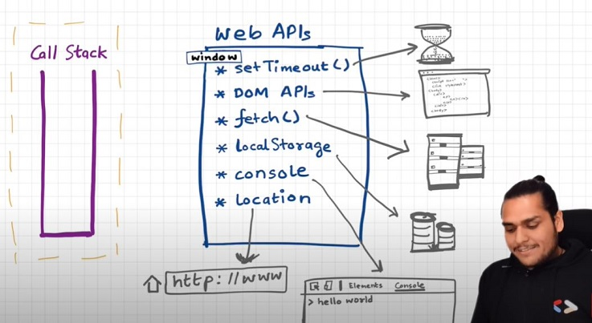

```js
console.log("Start")
setTimeout(function cbT() { console.log("CB Timeout") }, 5000)
fetch("https://api.github.com/users/alok722")
    .then(function cbF() { console.log("CB Netflix") })  // ~2 secs
console.log("End")

// Output order:
// "Start" → "End" → "CB Netflix" (after ~2s) → "CB Timeout" (after 5s)
// fetch callback goes to MICROTASK QUEUE (higher priority than callback queue)
```

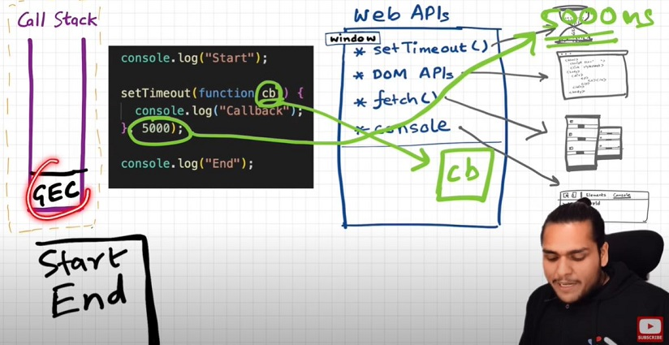
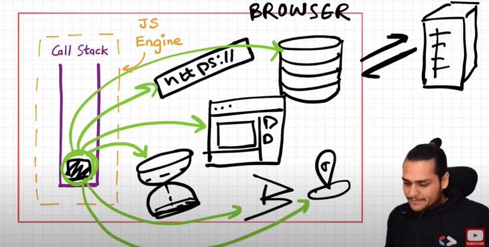
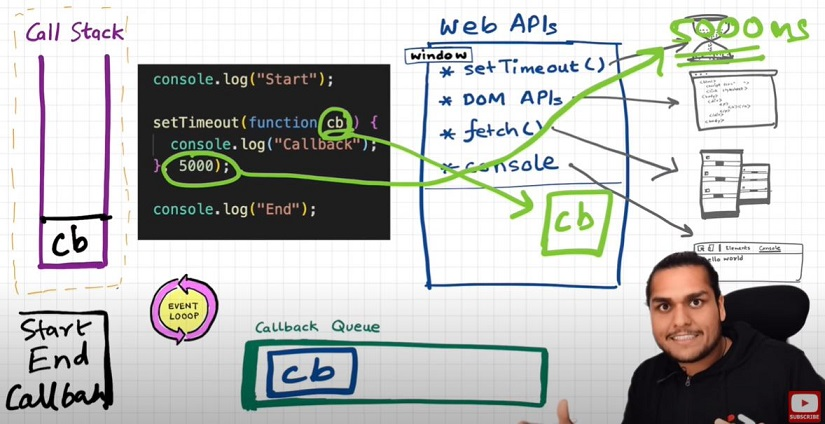
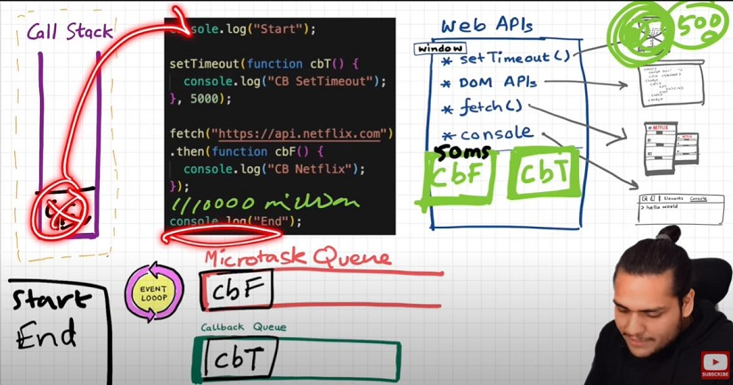

**Microtask Queue vs Callback Queue:**
- **Microtask Queue** — Promise `.then/.catch/.finally` callbacks + MutationObserver. **Higher priority** — drains completely before event loop checks callback queue.
- **Callback Queue** — setTimeout, setInterval, DOM event handlers. Lower priority.
- **Starvation** — if microtask callbacks keep spawning new microtasks, callbacks in the callback queue may never run.

**Step-by-step microtask queue visualization:**

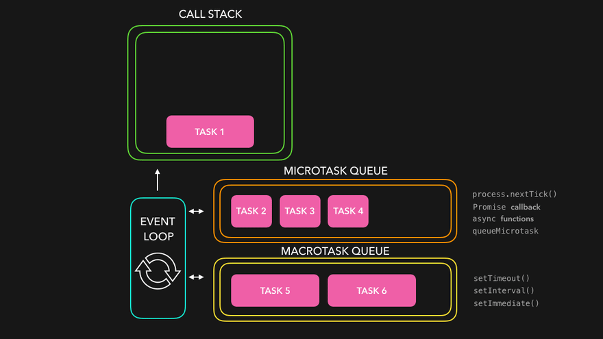
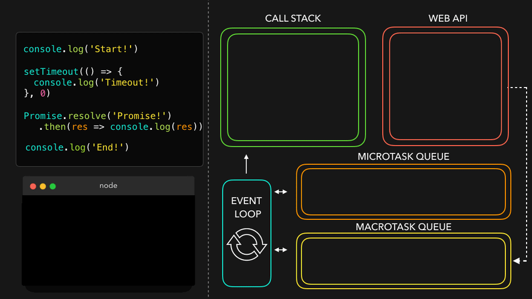
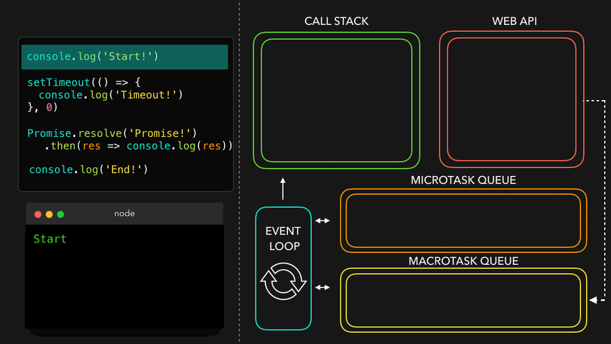
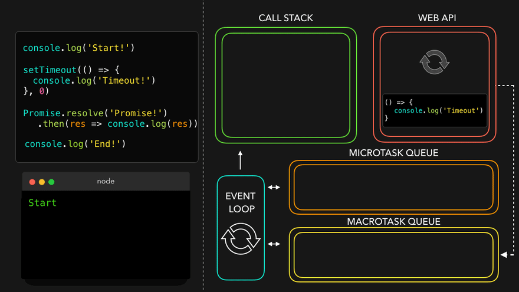
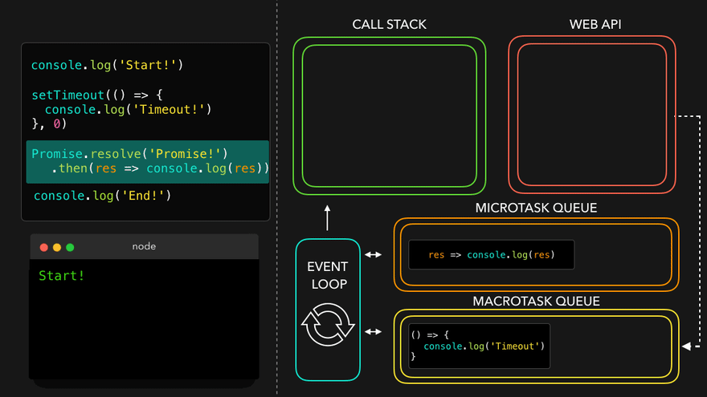
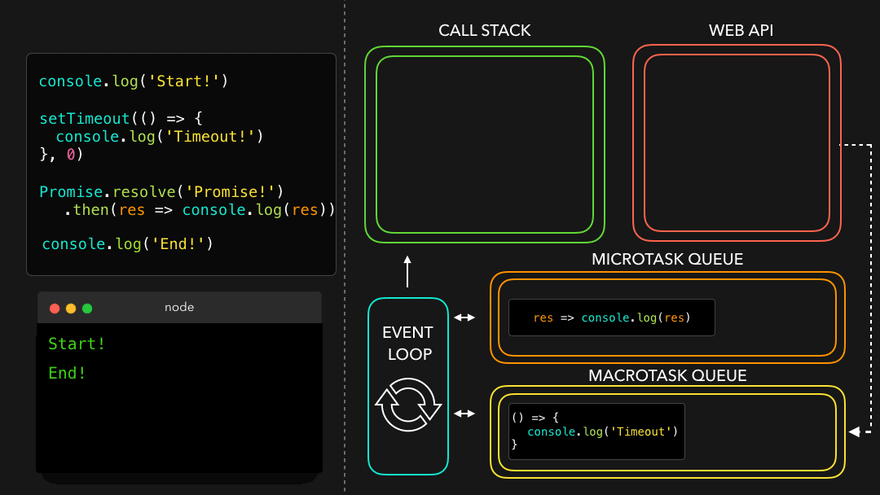
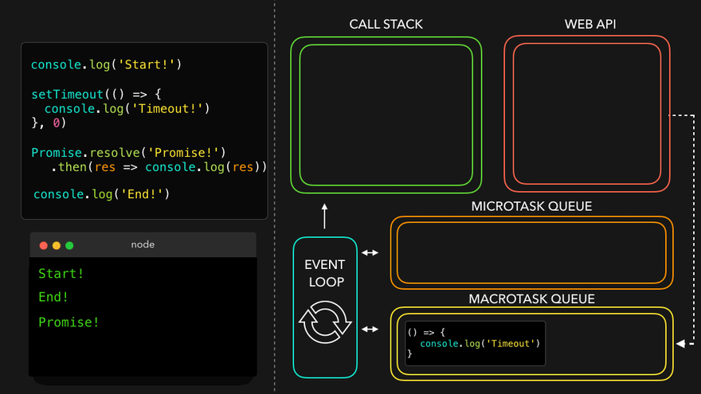

### Promises

> *"A Promise is an object representing the eventual completion or failure of an asynchronous operation."*

A **Promise** is a placeholder for a future value — an object with `promiseState` (pending/fulfilled/rejected) and `promiseResult` (the resolved value or rejection reason).

**Promise states:**
- `pending` — initial state; operation not yet complete
- `fulfilled` — `resolve(value)` was called; `promiseResult` has the value
- `rejected` — `reject(reason)` was called; `promiseResult` has the error

**Key guarantee:** A promise can only settle ONCE. It is **immutable** after settling — its value cannot be changed by anyone, making it safe to pass around.

```js
// Creating a Promise (producer side)
function createOrder(cart) {
    return new Promise(function(resolve, reject) {
        if (!validateCart(cart)) {
            reject(new Error("Cart is not valid"))  // failure path
        }
        const orderId = "12345"
        resolve(orderId)                            // success path
    })
}

// Consuming a Promise (consumer side)
const cart = ["shoes", "pants", "kurta"]
createOrder(cart)
    .then(function(orderId) {
        return proceedToPayment(orderId)  // ⚠️ always return from .then for chaining
    })
    .then(function(paymentInfo) {
        return showOrderSummary(paymentInfo)
    })
    .then(function(balance) {
        return updateWallet(balance)
    })
    .catch(function(err) {
        console.log(err)    // one .catch handles all rejections in the chain
    })
```

**Promise vs Callback — inversion of control solved:**
- With callbacks: you pass YOUR function to someone else → they control when it runs
- With promises: you attach `.then()` yourself → YOU control when the handler runs, and it fires exactly once

### async / await

**`async`/`await`** is syntactic sugar around Promises — it makes async code read like synchronous code without blocking the call stack.

- **`async` function** — always returns a Promise, even if you return a plain value
- **`await`** — pauses execution of the `async` function at that line, suspends the function from the call stack, and resumes when the Promise resolves. The call stack is NOT blocked.

```js
// async function always returns a Promise
async function getData() {
    return "Namaste JavaScript"
}
getData()  // Promise { fulfilled: 'Namaste JavaScript' }

// await suspends the function, not the whole thread
async function handlePromise() {
    console.log("Hi")               // prints immediately
    const val = await p             // function suspended here — call stack is free
    console.log("Hello There!")     // prints only after p resolves
    console.log(val)
}
```

```js
// Real-world: fetch with async/await + error handling
async function getUser() {
    try {
        const response = await fetch("https://api.github.com/users/alok722")
        const data = await response.json()   // .json() is also a Promise
        console.log(data)
    } catch (err) {
        console.log("Error:", err)
    }
}
getUser()
```

> **async/await vs .then/.catch:** They are equivalent in power — async/await is just a cleaner syntax. async/await is preferred for readability, especially when chaining multiple awaits.

### fetch API

`fetch` makes HTTP requests and returns a Promise. The response body must be parsed separately (also a Promise).


```js
fetch('https://api.github.com/users/hiteshchoudhary')
    .then(res => res.json())          // parse JSON body — also returns a Promise
    .then(data => console.log(data))  // the actual data object
    .catch(err => console.log(err))
```

---

## Step 39 — Error Handling: try / catch / finally

> [10_async/03_try_catch.js](10_async/03_try_catch.js)

**Errors are unavoidable** — network failures, invalid input, and unexpected state all cause exceptions at runtime. Without error handling, a single uncaught error crashes the entire program. The `try/catch/finally` block lets you intercept errors and respond gracefully.

**How the flow works:**
- `try` — wraps code that might throw; the moment an error is thrown, execution jumps to `catch`
- `catch` — receives the `Error` object; `error.name` identifies the type, `error.message` gives the description
- `finally` — always runs, whether an error occurred or not; ideal for cleanup (close a DB connection, stop a loading spinner)

**Built-in error types:**

| Type | Triggered by |
|------|-------------|
| `ReferenceError` | Accessing a variable that doesn't exist |
| `TypeError` | Wrong type operation — e.g. calling `null` as a function |
| `SyntaxError` | Invalid JSON in `JSON.parse()` |
| `RangeError` | Value out of allowed range — e.g. `new Array(-1)` |

```js
// Basic try/catch
try {
    console.log(undeclaredVar)   // throws ReferenceError
} catch (error) {
    console.log(error.name)      // "ReferenceError"
    console.log(error.message)   // "undeclaredVar is not defined"
}

// Throwing your own error
function divide(a, b) {
    if (b === 0) throw new Error("Division by zero")
    return a / b
}

// Re-throw pattern — only handle errors you understand
function parseConfig(str) {
    try {
        return JSON.parse(str)
    } catch (error) {
        if (error instanceof SyntaxError) return {}   // known — handle
        throw error                                    // unknown — re-throw
    }
}
```

**Key rule:** never silently swallow unknown errors with an empty catch block. If you don't know how to handle it, re-throw it so something higher up can.

---

## Step 40 — Custom Error Classes

> [10_async/04_custom_errors.js](10_async/04_custom_errors.js)

The built-in `Error` class is generic. Extending it lets you create **domain-specific error types** that carry extra context and can be identified with `instanceof` — enabling targeted catch blocks that handle only the errors they understand.

```js
class ValidationError extends Error {
    constructor(message, field) {
        super(message)                  // sets this.message
        this.name  = "ValidationError" // overrides default "Error"
        this.field = field             // custom: which field failed
    }
}

class NetworkError extends Error {
    constructor(message, statusCode) {
        super(message)
        this.name       = "NetworkError"
        this.statusCode = statusCode    // e.g. 404, 500
    }
}

// Targeted handling
try {
    throw new NetworkError("Not found", 404)
} catch (error) {
    if (error instanceof ValidationError) {
        console.log(`Bad input on field '${error.field}'`)
    } else if (error instanceof NetworkError) {
        console.log(`HTTP ${error.statusCode}: ${error.message}`)
    } else {
        throw error  // re-throw unexpected
    }
}
```

**Error wrapping pattern** — preserve both the domain context and the original cause:
```js
class DatabaseError extends Error {
    constructor(message, cause) {
        super(message)
        this.name  = "DatabaseError"
        this.cause = cause  // the original low-level error
    }
}
```

---

## Step 41 — Promise Combinators

> [10_async/05_promise_combinators.js](10_async/05_promise_combinators.js)

When you have multiple independent async operations, running them **one after another wastes time**. Promise combinators let you run them in parallel and coordinate the results.

> *"One simply doesn't use async/await without knowing Promises!"*

| Combinator | Resolves when | Rejects when | Behaviour |
|------------|--------------|-------------|-----------|
| `Promise.all` | ALL resolve | ANY rejects (fail fast) | Need every result to succeed |
| `Promise.allSettled` | ALL finish (any outcome) | Never | Want all results, even failures |
| `Promise.race` | FIRST settles | FIRST settles | Fastest wins, whether success or failure |
| `Promise.any` | FIRST fulfills | ALL reject (AggregateError) | First success wins, ignores rejections |

```js
const p1 = new Promise(resolve => setTimeout(() => resolve("P1 Success"), 3000))
const p2 = new Promise(resolve => setTimeout(() => resolve("P2 Success"), 1000))
const p3 = new Promise((_, reject) => setTimeout(() => reject("P3 Fail"), 2000))

// Promise.all — waits for all; fails immediately if any rejects
Promise.all([p1, p2, p3])
    .then(results => console.log(results))  // never reaches here (p3 fails at 2s)
    .catch(err => console.error(err))       // "P3 Fail" after 2s

// Promise.all — happy path (all resolve)
Promise.all([p1, p2])
    .then(results => console.log(results))  // ["P1 Success", "P2 Success"] after 3s

// Promise.allSettled — the safest; waits for all regardless of outcome
Promise.allSettled([p1, p2, p3])
    .then(results => console.log(results))
// [
//   { status: "fulfilled", value: "P1 Success" },
//   { status: "fulfilled", value: "P2 Success" },
//   { status: "rejected",  reason: "P3 Fail"   }
// ]

// Promise.race — first to settle wins (success OR failure)
Promise.race([p1, p2, p3])
    .then(result => console.log(result))    // "P2 Success" after 1s (p2 is fastest)
    .catch(err => console.error(err))

// Promise.any — first SUCCESS wins; ignores rejections
Promise.any([p1, p2, p3])
    .then(result => console.log(result))    // "P2 Success" after 1s
    .catch(err => {
        console.error(err)         // AggregateError (only if ALL reject)
        console.error(err.errors)  // ["P1 Fail", "P2 Fail", "P3 Fail"]
    })
```

```js
// Sequential (slow — each waits for the previous):
const user  = await fetchUser()
const posts = await fetchPosts()

// Parallel (fast — all start simultaneously):
const [user, posts] = await Promise.all([fetchUser(), fetchPosts()])

// race — timeout pattern
const withTimeout = (promise, ms) =>
    Promise.race([
        promise,
        new Promise((_, reject) =>
            setTimeout(() => reject(new Error(`Timed out after ${ms}ms`)), ms)
        )
    ])
```

---

## Step 42 — setTimeout Deep Dive: Timing & The Concurrency Model

> [10_async/06_settimeout_deep.js](10_async/06_settimeout_deep.js)

**`setTimeout` does not guarantee exact timing.** It guarantees a **minimum** wait — the callback may fire later depending on how busy the call stack is.

**Why:** when the timer expires, the callback goes into the **Callback Queue**. The Event Loop only moves it to the Call Stack when the stack is **completely empty**. If the main thread is busy, the callback waits.

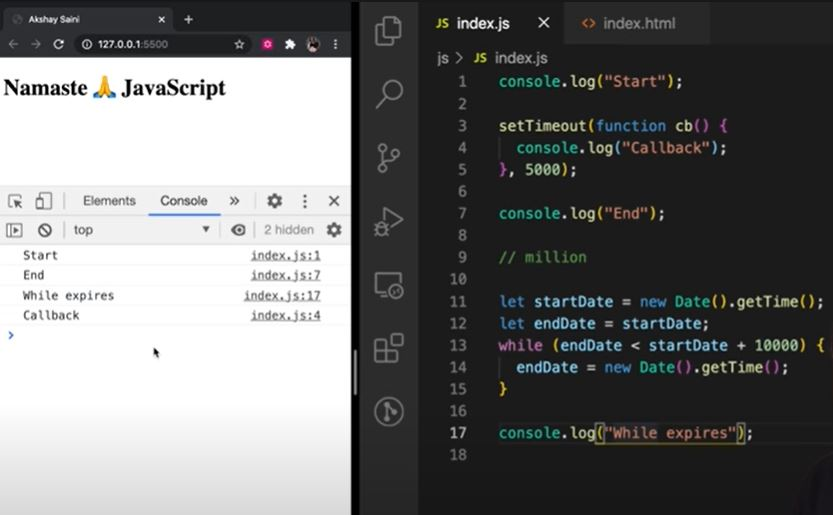

```js
console.log("Start")
setTimeout(cb, 5000)
console.log("End")
// ... 10 seconds of heavy synchronous code ...

// cb fires at ~10s, not ~5s — it had to wait for the stack to clear
```

**`setTimeout(fn, 0)`** — even with 0ms delay, the callback goes through the queue. It always runs after the current stack empties:

```js
console.log("A")
setTimeout(() => console.log("B"), 0)  // queued, not immediate
console.log("C")
// Output: A → C → B
```

**Practical use:** defer a low-priority task (loading ads, analytics) so higher-priority code runs first:
```js
renderMainContent()          // runs immediately
setTimeout(loadSidebar, 0)   // deferred — stack clears first
```

**The #1 rule of JavaScript:** never block the main thread. Heavy synchronous operations (large loops, heavy computation) block every timer, every event handler, and every Promise resolution until they finish.

---

**## Phase 11 — Modern JavaScript**

---

## Step 43 — Set and Map

> [11_modern_js/02_set_and_map.js](11_modern_js/02_set_and_map.js)

ES6 introduced two collection types that solve problems where plain arrays and objects fall short.

**Set** — a collection of **unique values**. Duplicates are silently ignored.

```js
const fruits = new Set(["apple", "banana", "apple"])
console.log(fruits.size)         // 2 — apple counted once

fruits.add("cherry")
fruits.has("banana")             // true
fruits.delete("banana")

// Most common use: remove duplicates from an array
const unique = [...new Set([1, 2, 2, 3, 3, 4])]  // [1, 2, 3, 4]

// Set operations
const union        = new Set([...setA, ...setB])
const intersection = new Set([...setA].filter(x => setB.has(x)))
const difference   = new Set([...setA].filter(x => !setB.has(x)))
```

**Map** — key-value pairs where **keys can be any type** (not just strings).

```js
const map = new Map()
map.set("India", "New Delhi")    // string key
map.set(userObj, { role: "admin" })  // object as key — impossible with {}

map.get("India")   // "New Delhi"
map.has("Japan")   // false
map.size           // 2

// Convert: Object ↔ Map
const fromObj = new Map(Object.entries({ x: 1, y: 2 }))
const toObj   = Object.fromEntries(map)
```

---

## Step 44 — JSON

> [11_modern_js/03_json.js](11_modern_js/03_json.js)

**JSON (JavaScript Object Notation)** is the universal format for transmitting data between a browser and server, storing config, and persisting state in localStorage. It is a plain **string** that looks like a JS object but follows strict rules.

**JSON rules** (stricter than JS object literals):
- Keys **must** be double-quoted strings
- Values can be: string, number, boolean, null, array, or object
- No functions, `undefined`, `Symbol`, `Date`, `NaN`, or `Infinity`
- No trailing commas

```js
// JS → JSON string
const json   = JSON.stringify(user)            // compact
const pretty = JSON.stringify(user, null, 2)   // 2-space indent

// Exclude sensitive keys
const safe = JSON.stringify(user, ["name", "age"])  // whitelist

// JSON string → JS
const parsed = JSON.parse(json)

// Always guard JSON.parse — it throws SyntaxError on invalid input
try {
    JSON.parse(untrustedString)
} catch (e) {
    console.log("Invalid JSON")
}

// Deep clone (simple objects only — loses functions, Dates become strings)
const clone = JSON.parse(JSON.stringify(original))

// localStorage pattern
localStorage.setItem("cart", JSON.stringify(cart))
const saved = JSON.parse(localStorage.getItem("cart") ?? "[]")
```

---

## Step 45 — Optional Chaining and Nullish Coalescing

> [11_modern_js/01_optional_chaining.js](11_modern_js/01_optional_chaining.js)

Two ES2020 operators that together **eliminate most defensive null-check guard chains**.

**Optional Chaining `?.`** — returns `undefined` instead of throwing if the left side is `null` or `undefined`:

```js
// Without ?.  (verbose)
const city = user && user.profile && user.profile.address && user.profile.address.city

// With ?.  (clean)
const city = user?.profile?.address?.city  // undefined if anything is null

// Safe method calls and bracket access
arr?.map(x => x * 2)     // undefined if arr is null
users?.[0]?.name         // undefined if array or element is null
```

**Nullish Coalescing `??`** — falls back only when the value is `null` or `undefined` (unlike `||` which also replaces `0`, `""`, `false`):

```js
const count = 0
count || 10   // 10  — WRONG: 0 is a valid value
count ?? 10   //  0  — CORRECT: 0 is not "missing"

// Combine both operators for safe access + fallback
const theme = settings?.display?.theme ?? "light"
```

**Nullish Assignment `??=`** — only assigns if the target is `null` or `undefined`:
```js
config.fontSize ??= 16   // sets 16 only if fontSize is null/undefined
```

---

## Step 46 — More Array Methods

> [11_modern_js/04_array_methods.js](11_modern_js/04_array_methods.js)

These complete the functional array toolkit alongside `filter`, `map`, and `reduce` from Step 20.

| Method | Returns | Use for |
|--------|---------|---------|
| `find(fn)` | First matching element (or `undefined`) | Get one item |
| `findIndex(fn)` | Index of first match (or `-1`) | Get position to update in place |
| `findLast(fn)` | Last matching element | Search from end |
| `some(fn)` | `true` if any element matches | OR logic — existence check |
| `every(fn)` | `true` if all elements match | AND logic — validation |
| `flatMap(fn)` | New flat array | 1-to-many transformations |
| `at(n)` | Element at index `n` (negative counts from end) | Last element, etc. |

```js
const products = [
    { id: 1, name: "Laptop",  price: 75000, inStock: true  },
    { id: 2, name: "Phone",   price: 35000, inStock: false },
]

products.find(p => p.price < 50000)        // { Phone... }
products.findIndex(p => p.name === "Phone") // 1
products.some(p => !p.inStock)             // true
products.every(p => p.price > 0)           // true

// flatMap — split each sentence into words (1 string → many strings)
["Hello world", "Chai JS"].flatMap(s => s.split(" "))
// ["Hello", "world", "Chai", "JS"]

// at() — clean negative index access
[10, 20, 30].at(-1)   // 30 (last element)
[10, 20, 30].at(-2)   // 20 (second-to-last)
```

---

**## Phase 12 — Functional Programming**

---

## Step 47 — Currying and Function Composition

> [12_functional/01_currying.js](12_functional/01_currying.js)

Functional programming patterns that build on closures (Step 22) to make functions more composable and reusable.

**Currying** — transforms a multi-argument function into a chain of single-argument functions:

```js
// Normal
const add = (a, b) => a + b
add(2, 3)  // 5

// Curried — one argument at a time
const curriedAdd = a => b => a + b
curriedAdd(2)(3)  // 5

// Partial application — lock in the first argument
const add5 = curriedAdd(5)
add5(3)   // 8
add5(10)  // 15

[1, 2, 3].map(add5)  // [6, 7, 8]
```

**Function Composition** — chain pure functions so the output of one feeds into the next:

```js
const pipe = (...fns) => x => fns.reduce((acc, fn) => fn(acc), x)

const trim         = str => str.trim()
const toLower      = str => str.toLowerCase()
const removeSpaces = str => str.replace(/\s+/g, "-")

const toSlug = pipe(trim, toLower, removeSpaces)
toSlug("  Hello World  ")  // "hello-world"
```

**Memoization** — cache a function's results so repeated calls with the same arguments return instantly:

```js
function memoize(fn) {
    const cache = new Map()
    return function(...args) {
        const key = JSON.stringify(args)
        if (cache.has(key)) return cache.get(key)
        const result = fn(...args)
        cache.set(key, result)
        return result
    }
}

const fib = memoize(n => n <= 1 ? n : fib(n-1) + fib(n-2))
fib(40)  // computed once, then cached
```

---

**## Phase 13 — Deep Dive**

---

## Step 48 — JavaScript Engine & V8 Architecture

> *Theory only — how your JS code actually runs under the hood*

Every JS environment (browser, Node.js, Deno) runs code through a **JavaScript Runtime Environment (JRE)** — a container that includes the JS engine, Web APIs, event loop, callback queue, and microtask queue.

**The JS engine processes code in 3 steps:**

**1. Parsing**
The source code is broken into tokens, then converted into an **Abstract Syntax Tree (AST)** — a JSON-like tree representing the program's structure. Try [astexplorer.net](https://astexplorer.net) to see any code as an AST.

**2. Compilation (JIT)**
JavaScript uses **Just-In-Time (JIT) compilation** — not purely interpreted, not purely compiled. The AST goes to an interpreter for fast startup (bytecode), while a separate optimizing compiler watches for "hot" code paths and recompiles them into highly optimized machine code at runtime.

**3. Execution**
Runs on the Call Stack with a Memory Heap for object storage. A garbage collector (V8 uses **Mark and Sweep**) automatically reclaims unused memory.

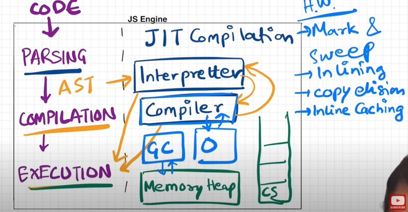


**Google's V8 Engine (Chrome, Node.js, Edge):**

| Component | Role |
|-----------|------|
| **Ignition** | Interpreter — converts AST to bytecode for fast startup |
| **TurboFan** | Optimizing compiler — converts hot bytecode to machine code |
| **Orinoco** | Garbage collector — Mark and Sweep algorithm |

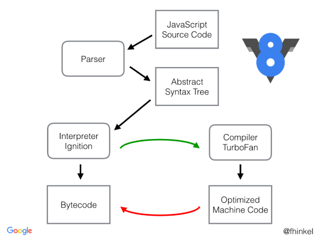

Popular JS engines by runtime:
- **V8** — Chrome, Node.js, Edge, Deno
- **SpiderMonkey** — Firefox (first ever JS engine, written by Brendan Eich)
- **JavaScriptCore (Nitro)** — Safari, iOS
- **Chakra** — Legacy Internet Explorer
